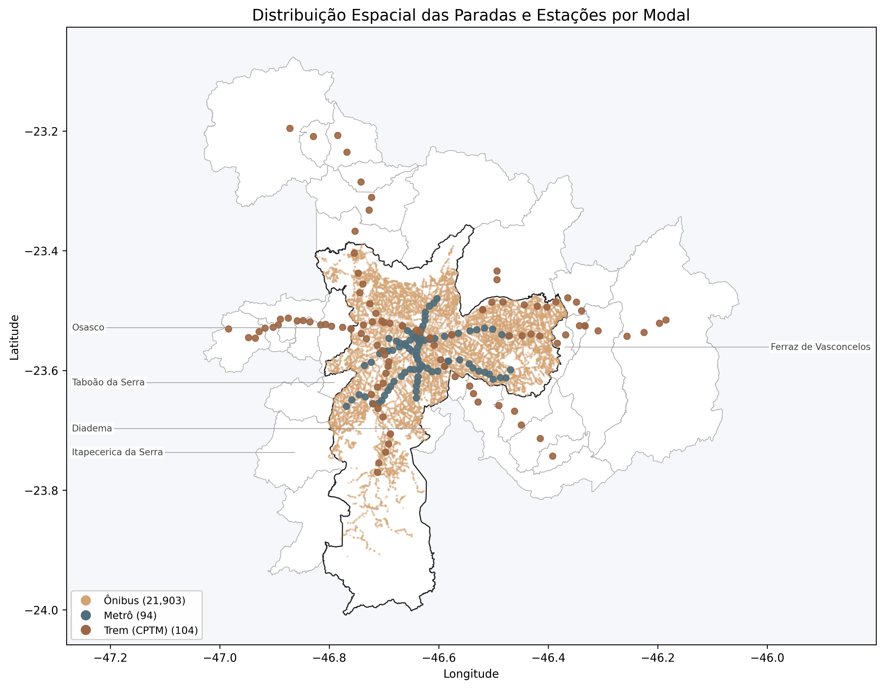
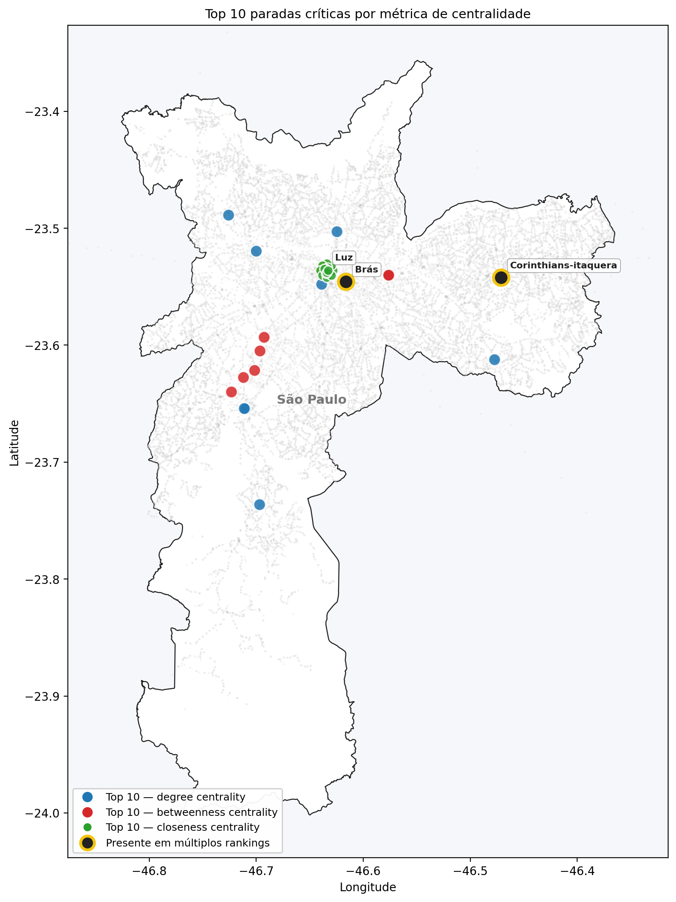
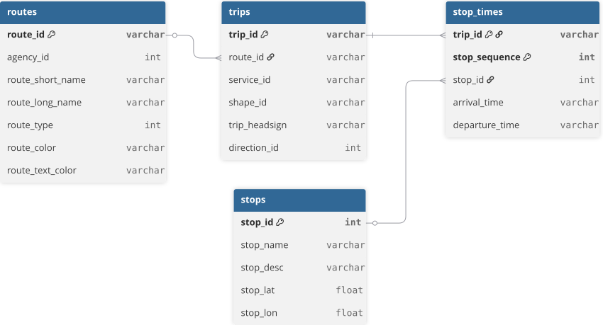

# Vulnerability and Resilience of São Paulo's Public Transit Network: A Topological Analysis Based on Graph Theory

<p align="center">
  
  
  
  
</p>



<br>

This repository contains analysis and tests conducted to explore and validate the hypotheses and results presented to the Undergraduate's Final Course Project (TCC): **“VULNERABILITY AND RESILIENCE OF THE SÃO PAULO PUBLIC TRANSIT NETWORK: A TOPOLOGICAL ANALYSIS BASED ON GRAPH THEORY”** ("Vulnerabilidade e Resiliência da Rede de Transporte Público de São Paulo: Uma Análise Topológica Baseada em Teoria dos Grafos"), a requirement for the Bachelor's Degree in Data Science at UNIVESP (Virtual University of the State of São Paulo).

## Full Thesis
The complete thesis, including detailed methodology, results, discussion, and references, is available in: [View the full thesis](docs/TCC.pdf).


---

## Key Findings
#### Estação Brás is the bottleneck of the network

<table>
  <tr>
    <td valign="center" style="width:40%">
      
    </td>
    <td valign="center" style="width:60%">
      With only 7 direct neighbors, the Brás CPTM station concentrates approximately 38% of the shortest paths of the network (classic articulator node in the complex networks paradigm - Albert, Jeong & Barabási, 2000). Its removal has disproportional impact to its local connectivity.
    </td>
  </tr>
</table>


#### The network is resilient to random failures, but vulnerable to targeted attacks
Empirical confirmation of the Albert-Barabási (2000) paradigm:

| Scenario | Fraction needed for LCC < 50% |
|---|:---:|
| Random Failure | > 20% (not reached) |
| Targeted Attack by *Degree Centrality* | **9%** |

#### Centrality metrics are complementary
Only 3 stations (Brás, Luz and Corinthians-Itaquera) appear in more than one top-10 ranking, and none of them appears in all three simultaneously. Each metric identifies a distinct dimension of criticality.

**Intersection of the top-10 stations by degree, betweenness and closeness centrality metrics**

| Intersection | Stops in common |
|:---|:---:|
| Degree $\cap$ Betweenness | 1 out of 10 |
| Degree $\cap$ Closeness | 0 out of 10 |
| Betweenness $\cap$ Closeness | 2 out of 10 |
| In all three rankings simultaneously | 0 out of 10 |


#### Institutional limit of the SPTrans network
48 CPTM stations along branches extending to municipalities of the São Paulo Metropolitan Region remain disconnected from the bus network even with the transfer radius extended to 600 meters. The limit is not methodological, but institutional: SPTrans operates exclusively within the city of São Paulo.

---

## Repository Structure

```bash
public-transit-graph-theory/
├── data/              # Datasets and data artifacts
│   ├── raw/           # Initial datasets (unprocessed)
│   │   ├── dryad/
│   │   ├── gtfs/
│   │   └── ibge/
│   │
│   └── processed/     # Data Artifacts
│
├── docs/              # Documentation & References
│   ├── bibliography/
│   │   ├── papers/
│   │   └── reading-outlines/
│
├── notebooks/
│   ├── exploratory/   # Initial data exploration and testing
│   │   ├── 00_eda-dryad.ipynb
│   │   ├── 01_research-gtfs.ipynb
│   │   ├── 02_test-OSMnx.ipynb
│   │   ├── 03_model-classification-hugging-face.ipynb
│   │   └── sp_transit_classifier.joblib
│   ├── 01_eda_gtfs.ipynb         # Exploratory Data Analysis
│   ├── 02_grafo.ipynb            # Graph modeling, Cmponents and Creation of Intermodal Integration
│   ├── 03_vulnerabilidade.ipynb  # Vulnerability Analysis
│   ├── 04_resiliencia.ipynb      # Resilience Analysis
│   └── 05_modelo-classificacao.ipynb
│
├── outputs/
│   ├── curvas_resiliencia_kappa.png     # Molloy-Reed parameter kappa
│   ├── curvas_resiliencia_lcc.png       # Largest Connected Component (LCC)
│   ├── mapa_paradas_modal_sp_rmsp.png   # SPTrans network 
│   ├── mapa_paradas_modal_sp.png        
│   ├── mapa_top10_centralidades.png     # Top 10 (degree, betweenness, closeness) critical nodes
│   └── mapas_regionais_integracao.png   # Intermodal Integration (3 km radius)
│
├── src/
│   └── notebook_setup.py
│
├── .gitignore
├── config.json
├── README.md
└── requirements.txt
```

---

## Datasets

| Dataset | Link |
|---|---|
| GTFS SPTrans | https://www.sptrans.com.br/desenvolvedores/ |
| IBGE | https://geoftp.ibge.gov.br/organizacao_do_territorio/malhas_territoriais/malhas_municipais/municipio_2024/ |


<br>

### Entity-Relationship Model
ERM-GTFS-SPTrans: [View the complete interactive diagram](https://dbdiagram.io/e/69ec0665c6a36f9c1b76016a/69ec0684c6a36f9c1b760206)

<br>





---

## Stack

| Library | Purpose |
|---|---|
| Python 3.11.x | Core programming language |
| pandas, NumPy | Tabular data manipulation |
| NetworkX | Graph modeling and analysis |
| GeoPandas | Geospatial operations |
| Matplotlib | Data visualization |
| SciPy (cKDTree) | Intermodal integration by radius |
| pyarrow | Parquet file handling |

---

<!-- ## Notebooks de Exploração

|  | Notebook | Description |
|---|---|---|
| 0 | [Dryad's EDA](https://github.com/cintia-shinoda/public-transit-graph-theory/blob/main/notebooks/00_eda-dryad.ipynb) | Exploratory data analysis of a sample of ticketing data from SPTrans |
| 1 | [GTFS-SPTrans' EDA](https://github.com/cintia-shinoda/public-transit-graph-theory/blob/main/notebooks/01_eda-gtfs.ipynb) | Exploratory analysis of GTFS from SPTrans |
| 2 | [OSMnx Test](https://github.com/cintia-shinoda/public-transit-graph-theory/blob/main/notebooks/02_test-OSMnx.ipynb) | Testing OSMnx for mapping and analyzing the transportation network of São Paulo |
| 3 | [Hugging Face's SPTrans Classifier Model](https://github.com/cintia-shinoda/public-transit-graph-theory/blob/main/notebooks/03_hugging-face.ipynb) | Implementation of a classification model for SPTrans data | -->

## Notebooks

| # | Notebook |
|---|---|
| 1 | [Análise Exploratória do GTFS-SPTrans](https://github.com/cintia-shinoda/public-transit-graph-theory/blob/main/notebooks/1_eda_gtfs.ipynb) |
| 2 | [Modelagem do Grafo, Componentes e Integração Intermodal](https://github.com/cintia-shinoda/public-transit-graph-theory/blob/main/notebooks/2_grafo.ipynb) |
| 3 | [Análise de Vulnerabilidade](https://github.com/cintia-shinoda/public-transit-graph-theory/blob/main/notebooks/3_vulnerabilidade.ipynb) |
| 4 | [Análise de Resiliência](https://github.com/cintia-shinoda/public-transit-graph-theory/blob/main/notebooks/4_resiliencia.ipynb) |

---


## Running the Project

1. Clone repository:
```bash
git clone https://github.com/cintia-shinoda/public-transit-graph-theory.git

cd public-transit-graph-theory
```

2. Create a virtual environment:
```bash
python3.11 -m venv venv

# MacOS / Linux: 
source venv/bin/activate

# Windows:
venv\Scripts\activate
```

3. Install dependencies:
```bash
pip install -r requirements.txt
```

---

## Licensing

### Source Code
All source code developed in this repository is licensed under the **Apache License 2.0**.
See [`LICENSE`](LICENSE).


### Documentation and Written Content
Academic documentation, explanatory texts, author-created diagrams, and written materials are licensed under: **Creative Commons Attribution-NonCommercial 4.0 International (CC BY-NC 4.0)**

This allows:
- Sharing
- Adaptation
- Citation
- 
Provided that:
- Proper attribution is given
- No commercial use is made


### Third-Party Data
This repository uses publicly available third-party datasets, including:
- Brazilian Institute of Geography and Statistics (IBGE)
- São Paulo Transport Authority (SPTrans)
**These datasets are NOT covered by this repository’s licenses.**

Their use remains subject to the original:
- terms of use
- access policies
- attribution requirements
- licensing conditions established by the official providers

Please refer to the official sources for details.


## Data Attribution

### IBGE
Source: Brazilian Institute of Geography and Statistics (IBGE)

Public datasets used for academic and analytical purposes.


### SPTrans

Source: São Paulo Transport Authority (SPTrans)

Public GTFS data and/or APIs used for academic and analytical purposes.


## Disclaimer

All analyses, interpretations, results, and conclusions presented in this repository are the sole responsibility of the author and do not represent official positions of the data providers.

---

## Academic Citation

If you use this work in academic research, please cite the author and repository appropriately.

---

## Author
Cintia I. Shinoda